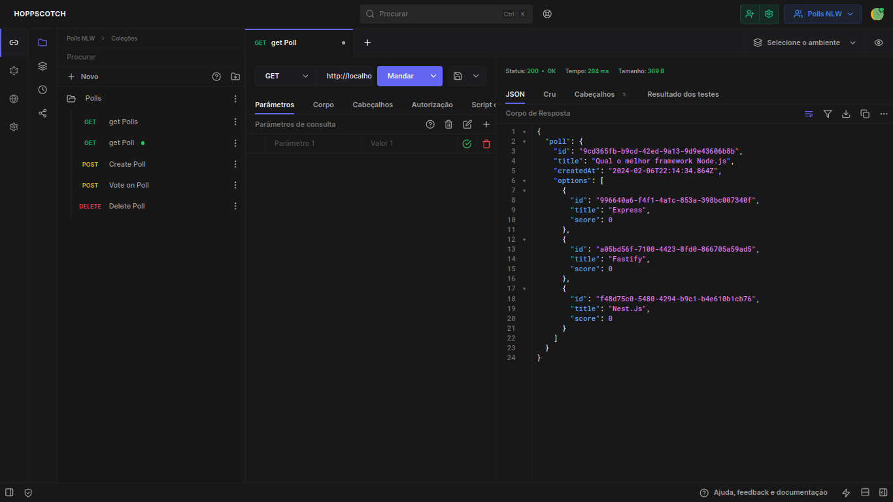

# API POLLS + WEBSOCKET

<p align="center">
  
  
  
  
</p>

<p align="center">
  <a href="#about">About</a> •
  <a href="#requirements">Requirements</a> •
  <a href="#installation">Installation</a> •
  <a href="#technologies">Technologies</a> •
  <a href="#author">Author</a>   
</p>

## About

This system offers an API for creating real-time polls using Node.js and WebSockets to transmit results instantly to users. With this platform, users can create, share, and interact with polls dynamically and collaboratively.




## Requirements

  - [x] **Functional Requirements (FR):**

1. *Poll Creation:* Users can easily create polls with questions and answer options.

2. *Real-time Results Transmission:* Using WebSockets, poll results are updated and transmitted instantly to all connected users.

3. *Interactive Participation:* Users can vote in polls and see results in real-time as votes occur.

4. *Poll Management:* Functionality to delete and view the history of created polls.


  - [x] **Non-Functional Requirements (NFR):**

    - [x] <a href="#technologies">Technologies</a> 


## Installation

Before you begin, you will need to have the following tools installed on your machine: [Git](https://git-scm.com) and [Node.js](https://nodejs.org/en/). Also, it's good to have an editor to work with the code such as [VSCode](https://code.visualstudio.com/).

### 🎲 Running the Back End (server)

```bash
# Clone this repository
$ git clone https://github.com/Josemar-cafumana/api-polls.git

# Navigate to the project's folder in the terminal/cmd
$ cd api-polls

# Install dependencies
$ npm install
# If you prefer using Yarn, execute the following command
$ yarn

# Configure environment variables
$ cp .env.example .env

# Execute Docker Compose to start the necessary services
$ docker-compose up -d

# Execute migrations with Prisma
$ npx prisma migrate dev
# If you prefer using Yarn, execute the following command
$ yarn prisma migrate dev

# Run the application in development mode
$ npm run dev
# If you prefer using Yarn, execute the following command
$ yarn dev

# The server will start on port 4000 or on the port defined in the .env file under the PORT variable - access <http://localhost:4000>
```


## Technologies

- [Node.js](https://nodejs.org/en/): A JavaScript runtime environment for server-side execution.

- [TypeScript](https://www.typescriptlang.org/): A superset of JavaScript that adds optional static typing.

- [Prisma](https://www.prisma.io/): A database ORM (Object-Relational Mapping) for Node.js and TypeScript.

- [Docker](https://www.docker.com/): A platform for developing, shipping, and running applications in containers.

- [Redis](https://redis.io/): An open-source, in-memory data store used for caching and other real-time data purposes.

- [PostgreSQL](https://www.postgresql.org/): An open-source relational database management system.

- [WebSockets](https://developer.mozilla.org/pt-BR/docs/WebSockets): A bidirectional communication protocol, allowing real-time interactions between clients and servers.

- [Fastify](https://www.fastify.io/): An extremely fast and efficient web framework for Node.js.


These technologies were chosen to provide an efficient development experience, facilitating the creation of a robust and modern application.

## Author

<div align="center">

<h1>Josemar Cafumana</h1>
<strong>Backend Developer</strong>
<br/>
<br/>
<div  style="display: flex; align-items: center: justify-content: center; text-align: center">

<a href="https://www.linkedin.com/in/josemar-cafumana-web-developer/" target="_blank">

</a>

<a href="https://github.com/Josemar-cafumana" target="_blank">

</a>

<a href="mailto:rjosemar-cafumana@hotmail.com" target="_blank">

</a>

<a href="https://wa.link/65562r" target="_blank">

</a>

</a>
</div>

<br/>
<br/>
</div>